<p align="center">
  <picture>
    <source media="(prefers-color-scheme: dark)" srcset="docs/logo-dark.png">
    <source media="(prefers-color-scheme: light)" srcset="docs/logo-light.png">
    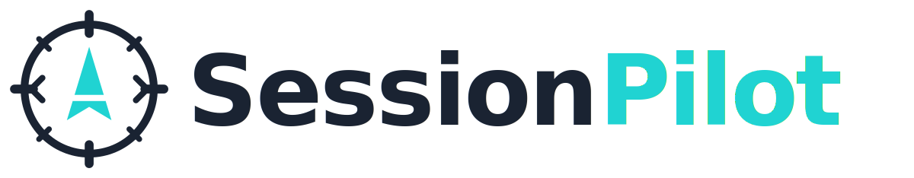
  </picture>
</p>

<p align="center">
  <strong>Your AI coding sessions deserve a cockpit.</strong><br>
  <em>Deine AI-Coding-Sessions verdienen ein Cockpit.</em>
</p>

<p align="center">
  Self-hosted dashboard to monitor, analyze, and review Claude Code sessions in real-time.<br>
  Track costs, manage projects, and keep your dev infrastructure in check — all in one place.
</p>

<p align="center">
  <a href="https://session-pilot.com">session-pilot.com</a>
</p>

<p align="center">
  <a href="#features">Features</a> •
  <a href="#screenshots">Screenshots</a> •
  <a href="#quick-start">Quick Start</a> •
  <a href="#configuration">Configuration</a> •
  <a href="#api">API</a> •
  <a href="#deutsch">Deutsch</a>
</p>

---

## Why SessionPilot?

If you use **Claude Code** daily across multiple projects, you know the pain: sessions scattered across accounts, no cost visibility, no way to review what happened yesterday. SessionPilot solves this by importing your Claude Code JSONL session files into a searchable, browsable, and analyzable web interface.

But it doesn't stop there — it also monitors your Docker containers, scans your project directories, integrates with Gitea, and gives you a unified command center for your entire dev environment.

## Features

### Claude Code Session Management
- **Live Session Viewer** — Browse sessions with full Markdown rendering, syntax-highlighted code blocks, and timestamps per message
- **Smart Message Types** — Distinguishes between User input, Assistant responses, and Tool Results (Bash, Grep, Read, etc.)
- **Table of Contents** — Right sidebar with navigable TOC, numbered user questions as "chapters", scroll tracking
- **Multi-Account Support** — Monitor multiple Claude Code accounts simultaneously
- **Session Reviews** — Rate sessions (OK / Needs Fix / Reverted / Partial), add notes, link review threads across sessions
- **Export** — JSON, Markdown, HTML, XLSX, TXT

### Live Usage Monitor
- **Real-time JSONL Parsing** — Reads Claude Code session files directly for instant metrics, no database sync needed
- **Terminal-Style Dashboard** — Inspired by [Claude-Code-Usage-Monitor](https://github.com/Maciek-roboblog/Claude-Code-Usage-Monitor), with progress bars, burn rates, and predictions
- **P90 Dynamic Limits** — Automatically calculates session limits from your historical usage patterns (90th percentile)
- **Session & Week Tracking** — Current 5h billing window with reset time, plus 7-day aggregate totals
- **Burn Rate Analytics** — Tokens/min, cost/min, cost/hour with recent vs. average comparison
- **Predictions** — When cost, token, and message limits will be reached, with exact clock times
- **Token Breakdown** — Input, output, cache read, cache create tokens displayed separately
- **5h Session Blocks** — Visual blocks showing each billing window with activity bars
- **OpenTelemetry Ready** — Built-in OTLP receiver for real Anthropic rate-limit data when `CLAUDE_CODE_ENABLE_TELEMETRY=1` is set
- **Multi-Account** — Monitors all Claude Code accounts simultaneously

### Cost Analysis & Analytics
- **Cost Dashboard** — Estimated API costs by model (Opus, Sonnet, Haiku), project, and time period
- **Token Tracking** — Input/output tokens per session, model, and project
- **Activity Charts** — Daily activity, hourly distribution, weekday heatmap
- **Tool Usage Ranking** — Most-used tools with visual bars and gradient highlights
- **Project Cost Ranking** — Top projects by cost with color-coded tiers
- **AI Timesheets** — Automatic time tracking based on session data

### Project Management
- **Auto-Discovery** — Scans your project directory and detects project types (monorepo, fork, tool, library, etc.)
- **Project Detail with Tabs** — Tabbed project view: Overview, Sessions, Plans, Documents, Relations — instead of a single long page
- **Plans Integration** — See which Claude Code plans belong to each project, linked to sessions
- **Sub-Project Detection** — Monorepo support for `apps/`, `packages/`, `services/` directories
- **Project Scaffolding** — Create new projects from templates
- **Relations & Groups** — Manage project dependencies, custom groups, favorites
- **Ideas & Notes** — Capture project-related ideas with categories

### Plans Management
- **Plan Import** — Automatically imports Claude Code plans from `~/.claude/plans/` into PostgreSQL
- **Project Matching** — Detects which project a plan belongs to by scanning for `/mnt/projects/` paths in plan content
- **Session Linking** — Correlates plans with sessions via timestamp matching
- **Auto-Status** — Determines plan status (completed, in-progress, stale) based on file age and session activity
- **Category Detection** — Identifies plan categories: feature, bugfix, refactor, setup, etc.
- **Filterable Overview** — Browse all plans with filters for project, status, and category

### Scheduled Tasks
- **Task Dashboard** — Manage scheduled tasks for Claude Code automation
- **RemoteTrigger Integration** — Create and manage persistent Claude Code RemoteTriggers (cron-based)
- **Task Templates** — Pre-built templates for health checks, backup verification, and monitoring
- **Enable/Disable** — Toggle tasks on/off without deleting them

### Code Quality
- **Quality Dashboard** — Score overview (A–F) for all scanned projects, drill-down into issues by category
- **7 Automated Checks** — File sizes, code duplication (jscpd), cyclomatic complexity (radon), CSS quality, JS duplicates, architecture rules, test detection
- **Baseline & Diff** — Freeze current state, track only new/fixed issues — no noise from legacy code
- **Scan & Baseline from GUI** — One-click scan and baseline per project, no CLI required
- **AI Quality Templates** — Generate `AI_QUALITY.md` and `AI_TASKS.md` for AI-assisted refactoring
- **Pre-commit Hook** — Guards against file size violations, secrets, architecture rule breaks, and utility duplication

### DevOps & Infrastructure
- **Docker Container Dashboard** — Live status with health checks, ports, uptime
- **Dependency Tracker** — Dependencies across all projects (npm, pip, composer, etc.)
- **Gitea Integration** — Repository info, branches, commits via Gitea API
- **Notifications** — Background thread checks every 60s for container issues, sync status, new projects

### Search & Navigation
- **Full-Text Search** — Ripgrep-powered search across all projects with type filters
- **Command Palette** — Ctrl+K quick search across projects, sessions, and documents
- **Document Browser** — Browse, view, edit, and upload files

### Technical
- Flask with modular Blueprint architecture (21 route modules, 21 services)
- PostgreSQL for session data with connection pooling
- JSON file cache with TTL for fast project scans
- `auto_coder` quality scanner with baseline/diff workflow
- Dark theme with design token system
- Responsive layout with collapsible sidebar
- No build step — runs directly, no compilation needed
- Docker & systemd deployment options

## Screenshots

**Project Dashboard** — All projects at a glance with priority, progress, milestones, and Git status.
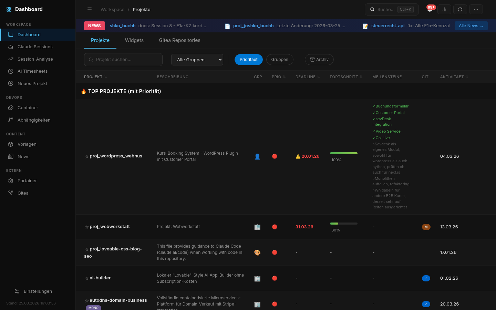

**Session List** — Browse all Claude Code sessions with filters, accounts, models, and outcome badges.
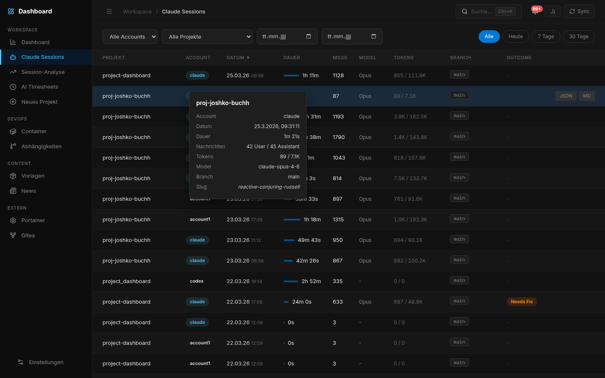

**Cost Analysis** — Track spending by model, project, and time period. Weekday heatmap and tool usage ranking.
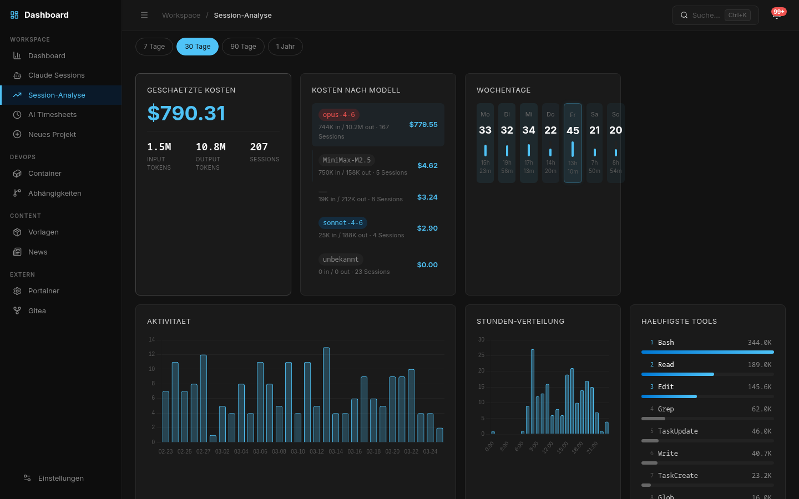

**Session Detail** — Full conversation with Markdown rendering, timestamps, tool results, and Table of Contents.
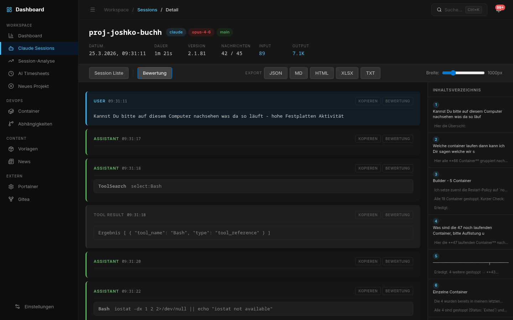

**Project Detail (Tabs)** — Tabbed project view with overview, sessions, plans, documents, and relations.
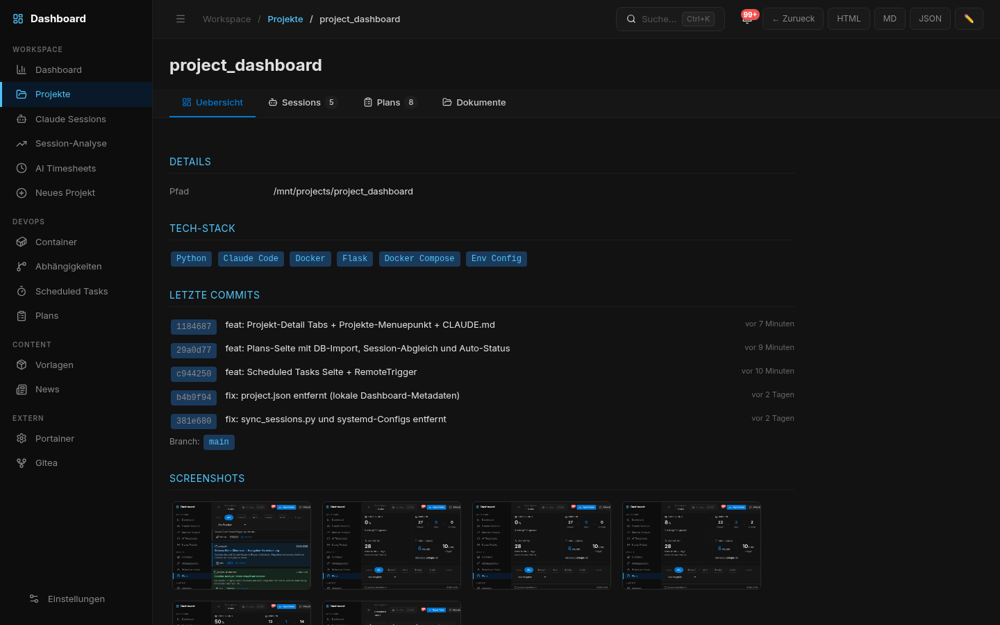

**Plans** — Browse and manage Claude Code plans, linked to projects and sessions, with auto-detected status.
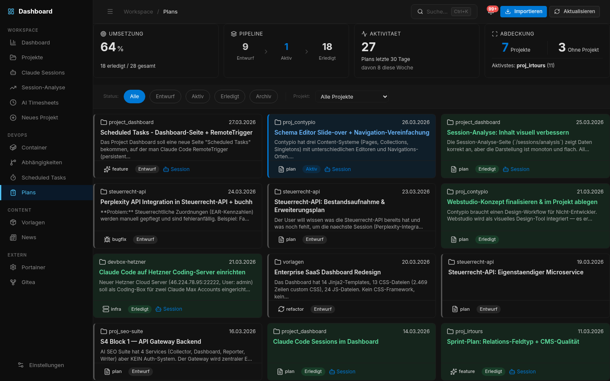

**Scheduled Tasks** — Manage scheduled automation tasks with RemoteTrigger integration.
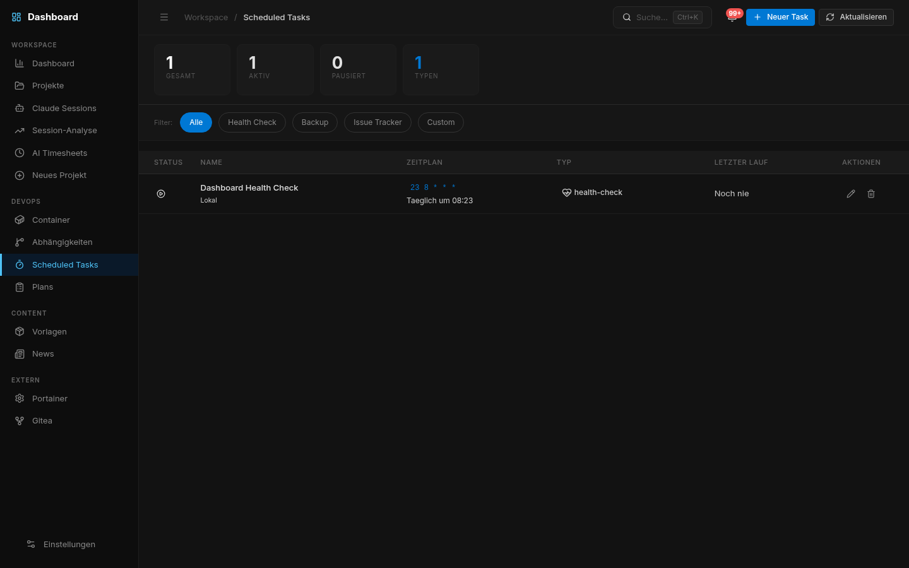

**Usage Monitor** — Real-time token usage, burn rates, cost predictions, and session blocks with P90-based limits.
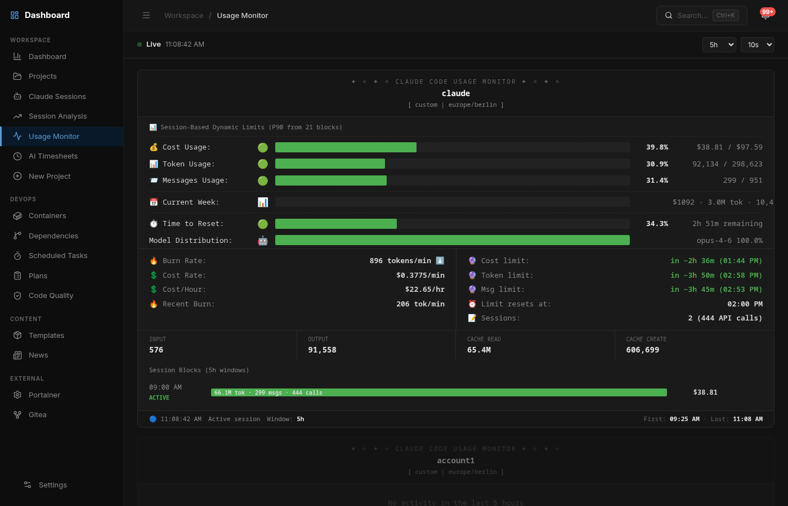

**Code Quality** — Score overview for all projects with drill-down into issues by category.
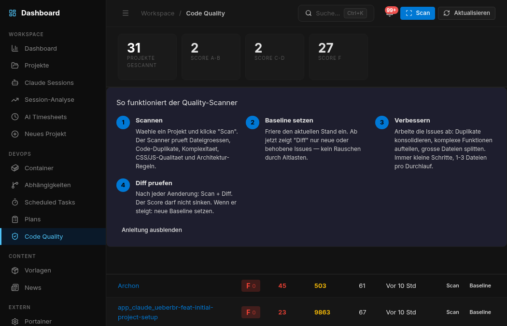

**Container Dashboard** — Live Docker container status with health checks and quick actions.
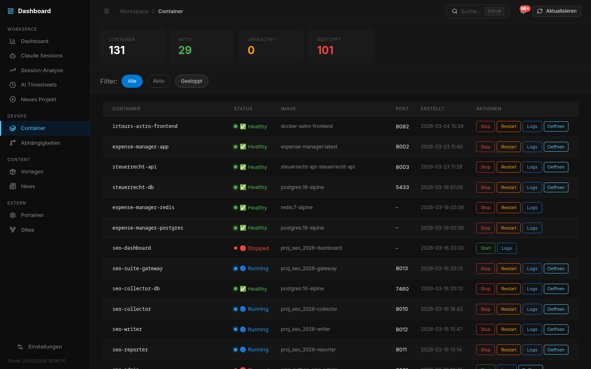

## Quick Start

### Option A: Docker (recommended, any platform)

```bash
git clone https://github.com/web-werkstatt/session-pilot.git
cd session-pilot
cp .env.example .env
# Edit .env (set your project path, DB credentials, optional Gitea token)
docker compose up -d
```

Open http://localhost:5055 (or your configured `DASHBOARD_PORT`)

### Option B: Interactive Setup (Linux / macOS)

The setup wizard checks prerequisites, finds free ports, and guides you through each step:

```bash
git clone https://github.com/web-werkstatt/session-pilot.git
cd session-pilot
./setup.sh
```

### Option C: Interactive Setup (Windows)

```powershell
git clone https://github.com/web-werkstatt/session-pilot.git
cd session-pilot
powershell -ExecutionPolicy Bypass -File setup.ps1
```

### Option D: Manual

```bash
git clone https://github.com/web-werkstatt/session-pilot.git
cd session-pilot
pip3 install -r requirements.txt
cp .env.example .env
# Edit .env
python3 app.py
```

## Configuration

All settings via environment variables (`.env` file):

| Variable | Description | Default |
|---|---|---|
| `DASHBOARD_PROJECTS_DIR` | Path to your projects | `/mnt/projects` |
| `DASHBOARD_PORT` | Web server port | `5055` |
| `GITEA_URL` | Gitea server URL | — |
| `GITEA_TOKEN` | Gitea API token | — |
| `GITEA_USER` | Gitea username | — |
| `DB_HOST` | PostgreSQL host | `localhost` |
| `DB_PORT` | PostgreSQL port | `5432` |
| `DB_NAME` | Database name | `project_dashboard` |
| `DB_USER` | DB user | `autodns` |
| `DB_PASSWORD` | DB password | — |

### OpenTelemetry (Usage Monitor)

To get real Anthropic rate-limit data in the Usage Monitor, set these environment variables before starting Claude Code:

```bash
export CLAUDE_CODE_ENABLE_TELEMETRY=1
export OTEL_METRICS_EXPORTER=otlp
export OTEL_EXPORTER_OTLP_PROTOCOL=http/protobuf
export OTEL_EXPORTER_OTLP_ENDPOINT=http://localhost:5055
```

Add to `~/.bashrc` for persistence. Without OTel, the monitor uses P90-based limit estimation from JSONL files.

## Prerequisites

| Component | Required | Used for |
|---|---|---|
| Python 3.9+ | Yes | Application |
| PostgreSQL 14+ | Optional | Claude Code sessions |
| Docker | Optional | Container status monitoring |
| Git | Optional | Git status, commits |
| Gitea | Optional | Remote sync status |
| ripgrep (rg) | Optional | Full-text search |

Without PostgreSQL, everything works except the Sessions feature.

### Supported Platforms

| Platform | Status | Notes |
|---|---|---|
| **Linux** (Debian/Ubuntu) | Fully tested | Primary platform, systemd service included |
| **macOS** | Supported | Same paths as Linux (`~/.claude/`), run via `python3 app.py` |
| **Windows** | Supported | Checks `%APPDATA%` and `%LOCALAPPDATA%` for AI accounts |
| **Docker** | Supported | `docker compose up -d` on any platform |

All paths are configurable via environment variables. Set `DASHBOARD_PROJECTS_DIR` to your projects root folder (default: `/mnt/projects`).

## API

| Endpoint | Method | Description |
|---|---|---|
| `/api/data` | GET | All project data + stats |
| `/api/containers` | GET | Docker container list |
| `/api/sessions` | GET | Claude Code sessions |
| `/api/sessions/sync` | POST | Import/sync sessions |
| `/api/sessions/analysis` | GET | Cost & usage analytics |
| `/api/sessions/<uuid>` | GET | Session detail with messages |
| `/api/sessions/<uuid>/export` | GET | Export (json/md/html/xlsx/txt) |
| `/api/sessions/<uuid>/outcome` | POST | Set session review status |
| `/api/sessions/<uuid>/reviews` | POST | Add review note |
| `/api/timesheets` | GET | AI timesheet data |
| `/api/info?name=X` | GET | Comprehensive project info |
| `/api/project/<name>` | GET | Load project.json |
| `/api/project/save` | POST | Save project.json |
| `/api/search` | GET | Full-text search |
| `/api/groups` | GET/POST | Manage groups |
| `/api/relations` | GET/POST | Manage relations |
| `/api/ideas` | GET/POST | Manage ideas |
| `/api/notifications` | GET | Notification list |
| `/api/scheduled-tasks` | GET | List all scheduled tasks |
| `/api/scheduled-tasks` | POST | Create a scheduled task |
| `/api/scheduled-tasks/<id>` | PUT | Update a task |
| `/api/scheduled-tasks/<id>` | DELETE | Delete a task |
| `/api/scheduled-tasks/<id>/toggle` | POST | Enable/disable a task |
| `/api/scheduled-tasks/templates` | GET | Available task templates |
| `/api/plans` | GET | List all plans (filter by project/status/category) |
| `/api/plans/<id>` | GET | Plan detail with Markdown content |
| `/api/plans/<id>` | PUT | Update plan (status, project assignment) |
| `/api/plans/sync` | POST | Import/sync plans from ~/.claude/plans/ |
| `/api/plans/stats` | GET | Plan statistics (by status, category, project) |
| `/api/plans/projects` | GET | Projects with plan counts |
| `/api/quality/projects` | GET | All projects with quality scores |
| `/api/quality/report/<name>` | GET | Detailed quality report + baseline diff |
| `/api/quality/scan/<name>` | POST | Trigger quality scan |
| `/api/quality/baseline/<name>` | POST | Set current report as baseline |
| `/api/usage-monitor/live` | GET | Live usage data (JSONL + OTel) |
| `/api/otel/metrics` | GET | Debug: raw OpenTelemetry metrics |
| `/v1/metrics` | POST | OTLP HTTP receiver for Claude Code telemetry |

## Backup

Automatic backup via cron:

```bash
# Daily backup (01:00, 7-day rotation)
scripts/backup.sh daily

# Weekly backup (Sunday 02:00, 4-week rotation)
scripts/backup.sh weekly
```

## Project Structure

```
project_dashboard/
├── app.py                    # Flask entry point
├── config.py                 # Configuration via env vars
├── routes/                   # 19 Blueprint modules
│   ├── session_routes.py     # Session CRUD, detail, export
│   ├── session_analysis_routes.py  # Cost & analytics API
│   ├── data_routes.py        # Main data aggregation
│   ├── project_routes.py     # Project info, save, assets
│   ├── document_routes.py    # Document browser & editor
│   ├── search_routes.py      # Full-text search via ripgrep
│   ├── timesheet_routes.py   # AI timesheets
│   ├── plans_routes.py       # Plans import, overview, detail
│   ├── scheduled_tasks_routes.py  # Scheduled task management
│   ├── quality_routes.py     # Code quality dashboard & API
│   └── ...                   # Groups, ideas, news, etc.
├── services/                 # 18 service classes
│   ├── session_import.py     # JSONL parser for Claude sessions
│   ├── session_export.py     # Multi-format export
│   ├── project_scanner.py    # Auto-discovery & caching
│   ├── project_detector.py   # Type detection (monorepo, fork, etc.)
│   ├── docker_service.py     # Docker container status
│   ├── gitea_service.py      # Gitea API integration
│   ├── plans_import.py       # Scans ~/.claude/plans/, imports to DB
│   └── ...                   # Git, cache, notifications, etc.
├── templates/                # Jinja2 templates
├── static/                   # CSS (design tokens), JS, assets
├── scripts/backup.sh         # Automated backup
├── docker-compose.yml        # Docker deployment
├── setup.sh                  # Bare-metal installer
└── requirements.txt          # Flask, psycopg2, markdown, openpyxl
```

## Roadmap

SessionPilot is actively developed. Here's what's coming next:

| Priority | Feature | Description |
|---|---|---|
| **Next** | **Error Class Tagging** | Categorize *why* sessions need fixes — hallucination, wrong context, missing domain knowledge, edge case, infra problem. Turn reviews into learning curves. |
| **Next** | **Git Diff per Session** | Show which files Claude Code actually changed. Diff view per session — what was generated vs. what survived review. Hard proof of real rework ratio. |
| **Planned** | **CLAUDE.md Effectiveness Tracking** | Version-track prompt files per project. Compare metrics (tokens/session, rework rate) before/after CLAUDE.md updates. |
| **Planned** | **Session Comparison** | Side-by-side comparison of two sessions — same task, different model (Opus vs. Sonnet), different prompt strategy. What worked better? |
| **Planned** | **LLM Model Benchmarking** | "Opus vs. Sonnet: rework rate over time" across all projects. Unique research-grade insights. |
| **Planned** | **Prompt Library** | Extract and rate reusable initial prompts per task type. Build a personal prompt playbook from real session data. |
| **Done** | ~~**Live Usage Monitor**~~ | Real-time token tracking with P90 limits, burn rates, predictions, and OpenTelemetry support. |
| **Done** | ~~**Multi-LLM Support**~~ | Codex CLI and Gemini CLI sessions are now supported alongside Claude Code. |
| **Planned** | **Quality CI Integration** | Run `auto_coder diff` in CI pipelines, block PRs on regressions. |
| **Future** | **Team Mode** | Shared dashboard for small teams with role-based views. |

Have an idea? [Open an issue](https://github.com/web-werkstatt/session-pilot/issues) or contribute directly.

## Contributing

Contributions welcome! This project is actively developed and used daily as the author's primary development tool.

## License

MIT

---

<a name="deutsch"></a>

## Deutsch

### Warum SessionPilot?

Wenn Du **Claude Code** taeglich mit mehreren Projekten nutzt, kennst Du das Problem: Sessions ueber verschiedene Accounts verstreut, keine Kostenuebersicht, kein Weg um nachzuvollziehen was gestern passiert ist. SessionPilot loest das, indem es deine Claude Code JSONL-Session-Dateien in eine durchsuchbare, browsbare und analysierbare Weboberflaeche importiert.

Aber das ist nicht alles — es ueberwacht auch Docker-Container, scannt Projektverzeichnisse, integriert sich mit Gitea und gibt dir ein einheitliches Kontrollzentrum fuer deine gesamte Entwicklungsumgebung.

### Features

**Claude Code Session-Verwaltung**
- Live Session Viewer mit Markdown-Rendering, Syntax-Highlighting und Zeitstempel pro Nachricht
- Intelligente Message-Typen: User-Eingaben, Assistant-Antworten und Tool-Results (Bash, Grep, Read etc.)
- Inhaltsverzeichnis-Sidebar mit Scroll-Tracking und nummerierten User-Fragen
- Multi-Account-Support fuer mehrere Claude Code Accounts
- Session-Bewertungen mit Status, Notizen und uebergreifenden Review-Threads
- Export als JSON, Markdown, HTML, XLSX, TXT

**Live Usage Monitor**
- Echtzeit-JSONL-Parsing: liest Claude Code Session-Dateien direkt, kein DB-Sync noetig
- Terminal-Style Dashboard mit Progress Bars, Burn Rates und Predictions
- P90-basierte dynamische Limits aus der Nutzungshistorie
- Session- und Wochen-Tracking mit Reset-Zeiten
- OpenTelemetry-Empfaenger fuer echte Anthropic Rate-Limit-Daten

**Kosten-Analyse & Statistiken**
- Geschaetzte API-Kosten nach Modell, Projekt und Zeitraum
- Token-Tracking (Input/Output) pro Session und Projekt
- Aktivitaets-Charts, Stunden-Verteilung, Wochentag-Heatmap
- Tool-Nutzungs-Ranking und Projekt-Kostenranking
- AI Timesheets mit automatischer Zeiterfassung

**Projekt-Verwaltung**
- Auto-Discovery: Erkennt Projekttyp, Tech-Stack, Sub-Projekte
- Projekt-Details mit Tabs: Uebersicht, Sessions, Plans, Dokumente, Beziehungen
- Scaffolding, Gruppen, Favoriten, Beziehungen, Ideen/Notizen

**Plans-Verwaltung**
- Import von Claude Code Plans aus `~/.claude/plans/` in PostgreSQL
- Automatische Projekt-Zuordnung anhand von Pfaden im Plan-Inhalt
- Session-Verknuepfung via Zeitstempel-Korrelation
- Auto-Status (fertig, in Arbeit, veraltet), Kategorie-Erkennung
- Filterbare Uebersicht nach Projekt, Status und Kategorie

**Scheduled Tasks**
- Dashboard zur Verwaltung geplanter Automatisierungsaufgaben
- RemoteTrigger-Integration fuer persistente Cron-basierte Tasks
- Vorlagen fuer Health-Checks, Backup-Verifizierung und Monitoring

**Code Quality**
- Quality-Dashboard mit Score-Uebersicht (A-F) fuer alle Projekte
- 7 automatisierte Checks: Dateigroessen, Duplikate, Komplexitaet, CSS/JS, Architektur, Tests
- Baseline-Vergleich: nur neue/behobene Issues anzeigen
- AI Quality Templates fuer AI-gestuetztes Refactoring

**DevOps & Infrastruktur**
- Docker Container Dashboard mit Health-Checks
- Dependency-Tracker ueber alle Projekte
- Gitea-Integration und Echtzeit-Benachrichtigungen

**Suche & Navigation**
- Volltextsuche via ripgrep ueber alle Projekte
- Ctrl+K Command Palette
- Dokumenten-Browser mit Editor

### Schnellstart

```bash
git clone https://github.com/web-werkstatt/session-pilot.git
cd session-pilot
cp .env.example .env
# .env anpassen (Projektpfad, DB-Zugangsdaten, optional Gitea-Token)
docker compose up -d
```

Dashboard oeffnen: http://localhost:5055 (oder konfigurierter `DASHBOARD_PORT`)

### Konfiguration

Alle Einstellungen via Umgebungsvariablen (`.env`-Datei):

| Variable | Beschreibung | Standard |
|---|---|---|
| `DASHBOARD_PROJECTS_DIR` | Pfad zu deinen Projekten | `/mnt/projects` |
| `DASHBOARD_PORT` | Web-Server Port | `5055` |
| `GITEA_URL` | Gitea Server URL | — |
| `GITEA_TOKEN` | Gitea API-Token | — |
| `DB_HOST` | PostgreSQL Host | `localhost` |
| `DB_NAME` | Datenbankname | `project_dashboard` |
| `DB_USER` | DB-Benutzer | `autodns` |
| `DB_PASSWORD` | DB-Passwort | — |

### Voraussetzungen

| Komponente | Erforderlich | Wofuer |
|---|---|---|
| Python 3.9+ | Ja | Anwendung |
| PostgreSQL 14+ | Optional | Claude Sessions |
| Docker | Optional | Container-Status |
| Git | Optional | Git-Status |
| ripgrep (rg) | Optional | Volltextsuche |

Ohne PostgreSQL funktioniert alles ausser dem Sessions-Feature.
